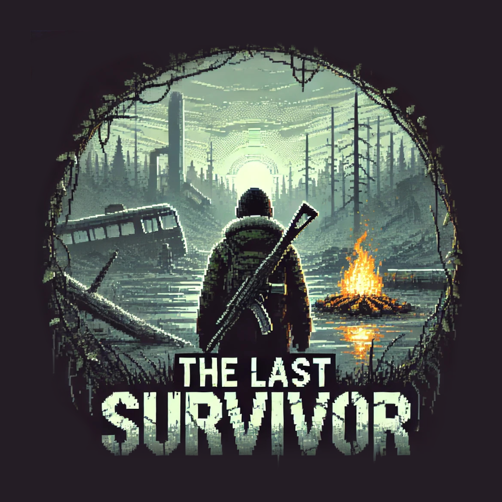

# The Last Survivor

.

## Overview

"The Last Survivor" is a survival game where players navigate various challenges to stay alive. This game is written in Python and aims to provide an immersive experience with engaging gameplay mechanics and a captivating story.

## Table of Contents

- [Prerequisites](#prerequisites)
- [Installation](#installation)
- [Creating an Executable](#creating-an-executable)
- [Usage](#usage)
- [Features](#features)
- [Contributing](#contributing)
- [License](#license)
- [Contact](#contact)

## Prerequisites

This project requires [Python 3.6+](https://www.python.org/) and [Git](https://git-scm.com/) installed on your machine. If you need to install them, click on the respective links.

## Installation

To run the game locally, follow these steps (if you install this game, please give it a view and maybe a star):

1. Clone the repository:
   ```bash
   git clone https://github.com/LeoLeman555/The_Last_Survivor.git
   ```
2. Navigate to the project directory:
   ```bash
   cd The_Last_Survivor
   ```
3. Create a virtual environment (recommended):
   ```bash
   python -m venv venv
   ```
4. Activate the virtual environment:
   - **On Windows**:
   ```bash
   venv\Scripts\activate
   ```
   - **On macOS/Linux**:
   ```bash
   source venv/bin/activate
   ```
5. Install the required dependencies:
   ```bash
   pip install -r requirements.txt
   ```
6. Start the game:
   ```bash
   python ./main.py
   ```

## Creating an Executable

If you'd like to create a standalone `.exe` file for The Last Survivor, you can use cx_Freeze. Follow these steps:

1) **Verify the setup.py file:** Make sure the provided `setup.py` file is in the root directory of the project. This file includes the necessary configuration for building the executable.

2) **Run the build command**: Use the following command to generate the `.exe` file:
   ```bash
   python setup.py build
   ```
This command will create a build directory containing your `.exe` file and other necessary files.

3) **Locate the executable:** After the build process is complete, navigate to the newly created build folder. Inside, you'll find the `.exe` file named `The Last Survivor.exe`.

4) **Distribute the game:** To share the game, package the .exe along with the files in the `build` folder into a compressed archive (e.g., a .zip file) for easier distribution.

*Note: Make sure all assets and required files (e.g., images, sounds, data files) are included in the build folder. The `setup.py` script is configured to include these files, so double-check that the paths are correct.*

> ⚠️ **Warning**: Creating the executable with `cx_Freeze` only works on **Windows**. 
> If you're using another operating system (Linux or macOS), the executable cannot be generated using this method.  
> However, you can still run the game directly via Python as explained in the [Installation](#installation) section.

## Usage

- Start the game using the command above.
- Use the arrow keys to move your character.
- Collect resources, avoid dangers, and try to survive as long as possible.

## Features

- **Immersive Gameplay** => Detailed environments and challenging scenarios.
- **Resource Management** => Collect and manage resources to stay alive.
- **Dynamic Challenges** => Encounter various dangers that test your survival skills.

## Contributing

We welcome contributions from the community. To contribute:

1. Fork the repository.
2. Create a new branch:
   ```bash
   git checkout -b feature/YourFeature
   ```
3. Make your changes and commit them:
   ```bash
   git commit -m "Add your message here"
   ```
4. Push to the branch:
   ```bash
   git push origin feature/YourFeature
   ```
5. Open a pull request.

## License

This project is licensed under the MIT License. See the [LICENSE](LICENSE) file for more details.

## Contact

For any questions or feedback, feel free to contact me:

- **Léo Leman** : [My GitHub Profile](https://github.com/LeoLeman555)
